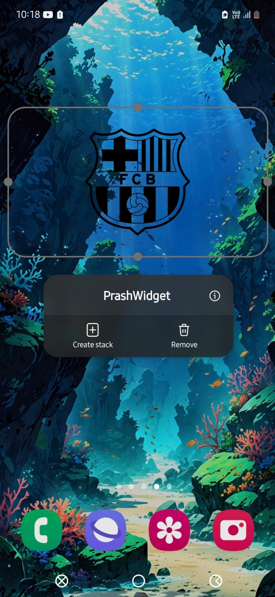

# FCB Widget

An Android home screen widget that proudly displays the iconic Black FC Barcelona (Barça) logo.

## Project Description

This project is a simple Android application built using Kotlin that provides a user-friendly widget. Once installed, you can add this widget to your device's home screen to show your support for FC Barcelona with a clear, static display of their club crest.

## Features

- Displays the official FC Barcelona club logo.
- Provides an easily accessible widget for your Android home screen.
- Built natively on the Android platform using Kotlin.

## Screenshots

Include a screenshot here showing the widget on a home screen. This helps users visualize what they are installing.



## Installation

You can install this widget by either building the project from source or, if available, downloading an APK release.

### Building from Source

1.  **Clone the Repository:**
    ```bash
    git clone https://github.com/PrashantDhuri08/FCB_Widget.git
    ```
    Replace `PrashantDhuri08` with your actual GitHub username.
2.  **Open in Android Studio:** Open the cloned project directory in Android Studio.
3.  **Build and Run:** Connect an Android device or start an emulator. Click the 'Run' button (the green play icon) in Android Studio. Select your target device/emulator. Android Studio will build and install the application on the device.

### From APK (If applicable)

If you provide APK releases, include instructions here. Otherwise, remove this section.

1.  **Download the APK:** Download the latest `app-release.apk` from the [Releases page]([Link to your Releases page]).
2.  **Enable Installation from Unknown Sources:** Go to your device's Settings > Security (or Apps & notifications > Advanced > Special app access > Install unknown apps) and allow installation from the source where you downloaded the APK (e.g., your browser or file manager).
3.  **Install the APK:** Locate the downloaded APK file using a file manager and tap on it to install.

## Usage

Once the "FCB Widget" application is installed on your device:

1.  Go to your Android home screen.
2.  **Long-press** on an empty area of the screen.
3.  Select the **"Widgets"** option from the menu that appears.
4.  Scroll through the list of available widgets and find **"FCB Widget"**.
5.  **Tap and hold** the "FCB Widget" entry.
6.  **Drag** the widget onto your home screen and place it where you want it.

The FC Barcelona logo should now be visible on your home screen!

_Note: The exact steps to add a widget may vary slightly depending on your device's manufacturer and launcher application._

Força Barça! 💙❤️
